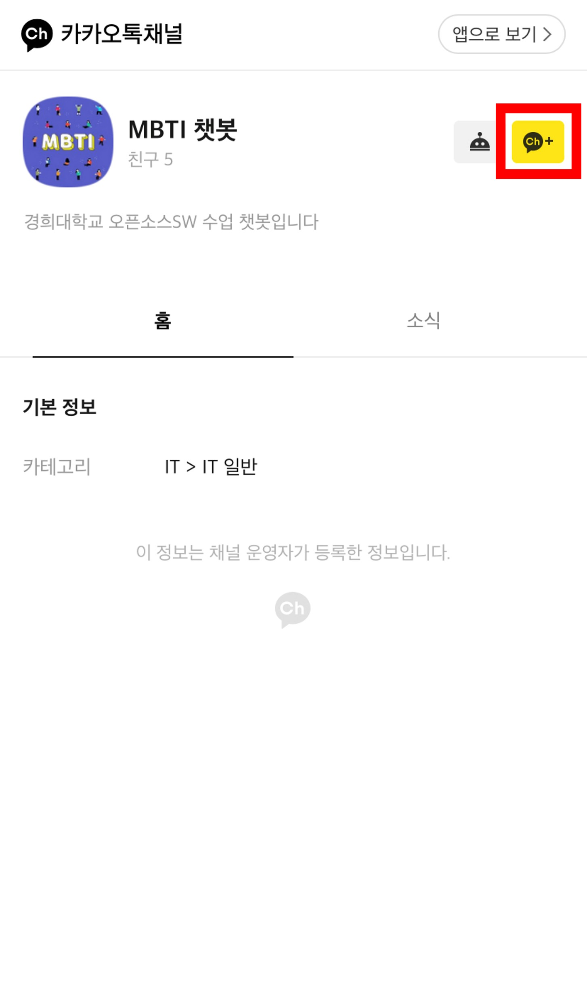

<!-- PROJECT LOGO -->
<br />
<div align="center">

  
  <h1 align="center">Find MBTI chatbot</h1>

</div>


## Table of Contents

1. [About The Project](#about-the-project)
2. [Built With](#built-with)
3. [Roadmap](#roadmap)
4. [Contributing](#contributing)
5. [Contact](#contact)


<!-- ABOUT THE PROJECT -->
## About The Project

* MBTI를 알기 위해서는 딱딱한 질문식의 설문을 일일히 체크해야 합니다.
* 저희는 그런 방식보다는 챗봇과의 대화를 통해 MBTI를 알아내는 방식을 챗봇에 적용하고자 합니다.
* 저희 챗봇은 Kakao Messaging API를 기반으로 만들어졌습니다.


<p align="right">(<a href="#top">back to top</a>)</p>


## Built With

* [Node.js](https://nodejs.org/ko/)
* [Express](https://expressjs.com/ko/)
* [Javascript](https://developer.mozilla.org/ko/docs/Web/JavaScript)

<p align="right">(<a href="#top">back to top</a>)</p>


## Installation

_Below is how to install our peoject._

1. Clone the repo
   ```sh
   git clone http://khuhub.khu.ac.kr/2018103692/find_mbti_bot
   ```
2. Install NPM packages
   ```sh
   npm install
   ```

<p align="right">(<a href="#top">back to top</a>)</p>


<!-- USAGE EXAMPLES -->
## Usage

1. "MBTI 챗봇" 채널을 추가해 주세요.
* link: <http://pf.kakao.com/_jAjtb>
</img><br/>

2. 채팅창에 "안녕"을 입력하면 챗봇이 메시지를 전송합니다.
</img><br/>

3. 전송된 메시지에서 "MBTI 테스트 시작하기" 버튼을 터치하면 MBTI 테스트를 진행할 수 있습니다.

<p align="right">(<a href="#top">back to top</a>)</p>


<!-- ROADMAP -->
## Roadmap

- [x] Kakao 채널 만들기
- [x] express 서버 연결
- [x] test
- [ ] MBTI설문을 챗봇에 적용시키기


<p align="right">(<a href="#top">back to top</a>)</p>


<!-- CONTRIBUTING -->
## Contributing

1. Fork the Project
2. Create your Feature Branch
3. Commit your Changes
4. Push to the Branch 
5. Open a Pull Request

<p align="right">(<a href="#top">back to top</a>)</p>


<!-- CONTACT -->
## Contact

* 김성욱 : so3659@khu.ac.kr
* 공정훈 : kjhun1208@khu.ac.kr
* 고민경: komg00@khu.ac.kr 

* Project Link : http://khuhub.khu.ac.kr/2018103692/find_mbti_bot

<p align="right">(<a href="#top">back to top</a>)</p>